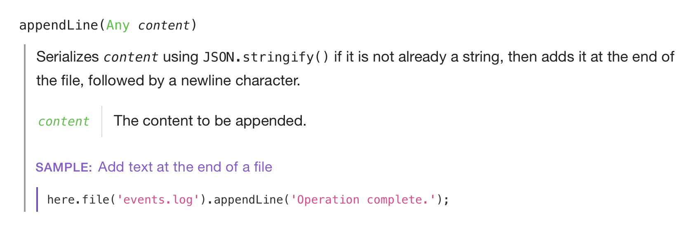

# 

*Painlessly automate in JavaScript.*

Write scripts that manipulate files, make network requests, get user input, all with a delightfully clear API. If you want to script things but don't want to use Bash, Tasklemon is what you've been wishing for all along. Yay!

Here's what a script to sort out files might look like:

````js
// Declare what arguments we accept
cli.accept({
    buildFolder: ['#0', Folder] // argument position in command, and argument type
});

const buildFolder = cli.args.buildFolder;
cli.tell(`Cleaning up ${buildFolder.name}…`);

// Delete and rename files
buildFolder.children.forEach(child => {
    if (child.extension === 'js') {
        child.name += '.build'; // js files are renamed
    } else {
        child.delete(); // the others are moved to the trash
    }
});
````

And with Tasklemon installed, you can just save this code into a file (say, `clean.js`) and run it in a single command; no imports, no preprocessing:

````bash
lemon clean.js some-folder
````

(you can also add a shebang to your scripts to make them directly executable, if you want; see below in Usage)

## Usage

### Installing

Install Tasklemon globally by running `npm install -g tasklemon`. This will make it available as `lemon` on the command&nbsp;line.

### Writing and running a script

To use Tasklemon, just write a script and save it into a file, then execute it by running `lemon your-script.js`. At runtime, Tasklemon exposes its entry points to your script, so you don't have to import anything. It also wraps all your code in an `async` function call, so that you can `await` promises wherever.

Optionally, you can add the `#!/usr/bin/env lemon` shebang to the very top of your script, and make it executable using `chmod u+x your-script.js`. You'll then be able to directly invoke the script on the command&nbsp;line, without calling `lemon`.

## Learning

To get started, I recommend you look at [the examples](#samples) below. They'll give you a good idea of the main features of Tasklemon.

After that, you can use the [API reference](http://cykelero.github.io/tasklemon/api/) to find what you need. The reference is approachable, straightforward, and replete with clear examples. Here's a sample of what it looks like:

<a href="http://cykelero.github.io/tasklemon/api/File.html"></a>

## Samples

### Writing and reading files

Add some text to a log file in the current working directory:

````js
here.file('events.log').appendLine('Operation complete.');
````

Read JSON from a file:

````js
const packageInfo = here.file('package.json').getContentAs(Object);
cli.tell(`The current project is ${packageInfo.name}.`);
````

### Declaring and getting script parameters

````js
// $ lemon adduser.js -a --name Rose

cli.accept({
    username: ['--name', String, 'Name of user to add'],
    isAdmin: ['-a', Boolean, 'Make user an admin']
});

return cli.args; // {username: 'Rose', isAdmin: true}
````

### Format data for display

Display a relative timestamp:

````js
const logDate = here.file('log.txt').dateModified;
cli.tell(format.date.relative(logDate)); // “3 minutes ago”
````

Display a number and pluralize its unit:

````js
cli.tell(format.number(1, 'carrot')); // “1.00 carrot”
cli.tell(format.number(4528.5, 'carrot')); // “4,528.50 carrots”
````

### Get JSON from a URL

````js
const tasklemonNpmDetails = await net.getJSON('https://registry.npmjs.org/tasklemon');
const lastReleaseDate = tasklemonNpmDetails.time.modified;

cli.tell('Last Tasklemon release was ' + format.date.relative(lastReleaseDate) + '.');
````

### Use the `dedupe` npm package

There is no need to ever install, or even import packages prior to using them.

````js
const friendNames = await cli.ask('What are your friends called?', Array);
const uniqueFriendNames = npm.dedupe(friendNames);

cli.tell('Total count of unique friend names: ' + uniqueFriendNames.length);
````

## Caveats

I really want Tasklemon to be awesome, but here are a few ways in which it's not.

- Tasklemon is still very young. It's got a test suite, sure, but it hasn't seen much real-world usage yet: expect bugs. (please do [report them](https://github.com/Cykelero/tasklemon/issues/new)!)
- By design, file operations are synchronous—just like in bash scripting, for example. That's great for usability, but you're not going to write concurrent server stuff with these.
- Symlinks aren't very well-supported yet. Just traversing them should be fine, but directly manipulating them will be weird.
- Tasklemon supports Windows, but with the exception of a few features, such as permission manipulation.

## Development

Clone Tasklemon and run `npm install`.

You can then:

- **try out your version of Tasklemon** by running `source/tasklemon.js some-script.js`
- **run the tests** using `npm run test` (or `npm run watch:test` for automatic runs)
- **build the api docs** using `npm run build-docs` (or `npm run watch:build-docs` for automatic builds)

## Thanks

Thanks to <a href="https://fabien-berini.fr">Fabien Bérini</a>, for all his help with making the unix-y parts reasonably sane :)
